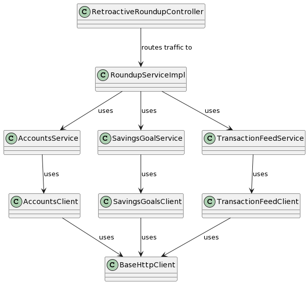
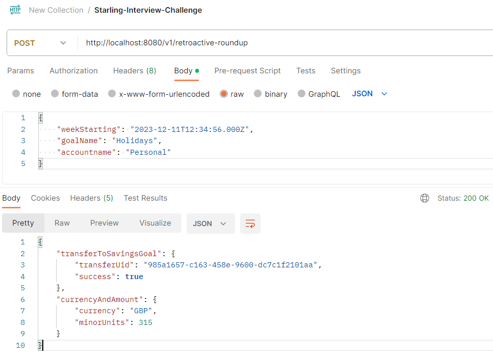

# Getting Started

Below project outlines an attempt by Hugh Pearse to complete the Starling Bank interview programming challenge.

## Cloning the repo

```bash
foo@bar:~$ git clone https://github.com/hughpearse/starling-interview-challenge.git
```

## How it works

1. A base HTTP client is configured for the hostname.
2. Each logical domain is assigned its own client (accounts, transactions etc) with URLs configured.
3. Each logical domain client is assigned a domain service (eg: get account -> or create account if doesnt exist)
4. The client logic is in a saparate logical domain (eg: roundup service)
5. The controller routes traffic to the roundup service which starts the whole process



## Requirements

Excerpt from PDF Challenge Details [here](./docs/Starling_Bank_Engineering__Technical_Challenge.pdf)

```text
The Challenge
We’d like you to develop a “round-up” feature for Starling customers using our public
developer API that is available to all customers and partners.
For a customer, take all the transactions in a given week and round them up to the nearest
pound. For example with spending of £4.35, £5.20 and £0.87, the round-up would be £1.58.
This amount should then be transferred into a savings goal, helping the customer save for
future adventures.

API calls
To make this work, the key parts from our public API you will need are:
1. Accounts - To retrieve accounts for the customer
2. Transaction feed - To retrieve transactions for the customer
3. Savings Goals - Create a savings goals and transfer money to savings goals
We do expect to see your working here: please do not use any of the libraries out there
which provide an sdk for interacting with our api.
```

Notes: implementation should be enterprise grade

## Requirements Summary

Given the following input parameters:
1. Date week start (eg: Sunday 1st January 2023, ending @ + 7 days)
2. Goal name (eg: Holidays)
3. Account name (eg: main current account)

Enumerate all transactions in that week, and for each transaction calculate the roundup and sum the total.

## Assumptions

Given the complex nature of these requirements and the limited time frame, the scope will be limited as follows:
1. A savings goal called "Holidays" will be created
2. Transactions with specific criteria will be settled
3. GBP currency
4. Transactions must be settled
5. Transactions must be towards the "OUT" direction

## Checklist for rubric

Below outlines some requirements to score points in the interview.

1. Compiles - YES
2. Launches/Runs - YES
3. Works as expected - YES
4. Automated tests - YES
5. Arrange Act Assert (AAA) - YES
6. Documentation - YES
7. Javadoc (code) - YES
8. Swagger (inbound API) - TODO
9. README instructions - YES
10. Code quality - YES
11. Domain Driven Design (DDD) - YES
12. Application of SOLID principals - YES
13. Error handling - YES
14. Logging - YES
15. Builds to jar - YES
16. Postman collection - YES
17. Docker runtime - YES

## Dependencies

Install Java 17

```bash
foo@bar:~$ wget https://download.oracle.com/java/17/latest/jdk-17_linux-x64_bin.rpm
foo@bar:~$ sudo yum -y install ./jdk-17_linux-x64_bin.rpm
```

## Build

Run the following command to build the classes

```bash
foo@bar:starling-interview-challenge$ ./gradlew build -x test
```

Run the following command to release the jar

```bash
foo@bar:starling-interview-challenge$ ./gradlew jar
```

## Launch

Run the following command to start the application locally 

```bash
foo@bar:starling-interview-challenge$ ./gradlew bootRun
```

Or if you cant be bothered installing java 17, launch one of the [releases](https://github.com/hughpearse/starling-interview-challenge/releases/) docker:

```bash
foo@bar:starling-interview-challenge$ docker run -p 8080:8080 -v $(pwd)/build/libs/challenge-0.0.1-SNAPSHOT.jar:/app.jar eclipse-temurin:17.0.9_9-jre-jammy java -jar /app.jar  --outboundclients.starling.core.accesstoken=eyJhbGciOiJQUzI1NiIsInppcCI6IkdaSVAifQ.H4sIAAAAAAAA_21TQZKjMAz8yhbn0ZQxJBBue9sP7AOEJSeuAZuyTWantvbva2ISQmpudLfUkizxtzAhFF2BkwHi0b2HiH4w9tyj_XhXbizeijD3KUJIxVwrBbXSDdRYnqBtyhZqWcpestBayxTMf6aiKxshTydxOIi3wmBcCVGXC4FKudnGX24g9r8Nrd5NhRJahZQKtCX0RC0QUtuwJqaTSN7RfbDNGaWUjcajgIqOFdSHIwJWQoAm3TeCKplqp4w01k-lOIStjq5Fcm-rPtUhAb2UB9DNoT2UjZRlWy4DKzfx8ii5U7jcWgWLI3eekX68CPFrehEMsY1GG_Z7fjAh7pgVEPnUZMdk4gNkJUZUl5EfkXO8OG9C2hAYS-ZqaMYhaz0OaNXaiUJPoJyN3g3Zd2FWzVlt_IjROAtOg54trfXUHKIb723ziGbNHtESRu6IB478gLewkSMmhJ1KcBHv-JY54RfzXcpgNclgCwIz4nn1zNr2CdGjDaiWnh80DE6l6TfvTIBbnuGVXbO802a4l8q1d9QtyrNiM8UdCHvp05vkHvCaVhHg7LY-dtw66o67-TwzeTidnv0bi038xmsTs6m6MM0DE6Sxt6sJHGMacJ5WOOH9TNLvnq4oHZPz9FR-z97r7tlv8sF92gcfeWkAVLi-UhPpTD3v9LaK1yUX__4DW1Ag7qEEAAA.uqs8ZsmyruW15xCbKs4k7AnY59Qutawg9lOVme04lsHN_uFCRWQjrWwK7jqblAF4k7keVVJkJXWBSPCo4U-44er-tmqFeYMcoICT5S7MLHtGtTk6A3yDHqNi8x7zGn1sS7nfD2Dy5znjl8VBzKq9xTW1yr_-Tbl7OtxMpPjt_Aok7XrMY-wYyJAtvLRYOHo372VZmF4lz4vIs-AP3H-Pc9frT6Hn8xhLPrZGeKCWOF-y22QutkgjOmw7dvJIx2xetKHEmPFZG6NJtsa99gaO_RjF3RLDcoX-iZm_Z5t5QF_U3EiJeaKK0UUhjt_qKhv8UtwYH35Bj1Q1mNohxTKWHzXwbCxsClQFYHW5D7hfd5YgiV7XFWZupb2O0ypp2kJTIrQdGGVFyb8_D9rr1o2TA4B-yMYOw_FAg1vx1U0WFn7ckbnPP6vm3-cso3AuKKwJBixtyJQmj-hx84fBqbdD7vBWd09-WLFPnhPQabrbcTwhHhNP_AxZy_us2NcvdUphb6DzipNEyxUMPfD7ohhkdwnpDxjObdSeWYan3PZU8ew3jwdI6kLMESkX6Z_SsqvAL3X8OqDMJczUQBw3dqj7mANa5ZKI5p7gr3fnprpN8-uREHyh4l9Czwe-BO8pxUypPZshqgUGGIj53PITun4LjcScI2NWx1EX0stFXNmGJ8M
```

## Tests

Run the following command to run junit tests

```bash
foo@bar:starling-interview-challenge$ ./gradlew test
```

## Consuming:

Send a post body similar to:
```json
{
  "weekStarting": "2023-12-11T12:34:56.000Z",
  "goalName": "Your Goal Name",
  "accountname": "Your Account Name"
}
```
as:

```bash
foo@bar:~$ curl -X POST -H "Content-Type: application/json" -d '{
  "weekStarting": "2023-12-11T12:34:56.000Z",
  "goalName": "Holidays",
  "accountname": "Personal"
}' http://localhost:8080/v1/retroactive-roundup
```

There is a provided postman collection [here](./docs/Starling-interview-challenge.postman_collection.json)



# Sample Logging output

```text
2023-12-18T16:43:37.365Z  INFO 17704 --- [nio-8080-exec-2] c.s.c.d.s.challenge.RoundupServiceImpl   : Roundup request received.
2023-12-18T16:43:37.365Z  INFO 17704 --- [nio-8080-exec-2] c.s.c.o.starling.BaseHttpClient          : Getting all accounts.
2023-12-18T16:43:38.056Z  INFO 17704 --- [nio-8080-exec-2] c.s.c.d.s.starling.AccountsService       : Account found.
2023-12-18T16:43:38.056Z  INFO 17704 --- [nio-8080-exec-2] c.s.c.o.starling.SavingsGoalsClient      : Getting savings goals
2023-12-18T16:43:38.192Z  INFO 17704 --- [nio-8080-exec-2] c.s.c.d.s.starling.SavingsGoalService    : Savings goal found.
2023-12-18T16:43:38.192Z  INFO 17704 --- [nio-8080-exec-2] c.s.c.o.starling.TransactionFeedClient   : Getting trancations from account 02ceb441-492e-43e1-8db7-58b4190d9f76 in range from 1702298096000 to 1702902896000
2023-12-18T16:43:38.388Z  INFO 17704 --- [nio-8080-exec-2] c.s.c.d.s.s.TransactionFeedService       : Got transaction feed.
2023-12-18T16:43:38.388Z  INFO 17704 --- [nio-8080-exec-2] c.s.c.d.s.challenge.RoundupServiceImpl   : Found 14 transactions.
2023-12-18T16:43:38.388Z  INFO 17704 --- [nio-8080-exec-2] c.s.c.d.s.challenge.RoundupServiceImpl   : Sum of roundup is 315 minor units.
2023-12-18T16:43:38.388Z  INFO 17704 --- [nio-8080-exec-2] c.s.c.o.starling.SavingsGoalsClient      : Transfering CurrencyAndAmount(currency=GBP, minorUnits=315) from account 02ceb441-492e-43e1-8db7-58b4190d9f76 to savings goal 12434de2-28cd-4230-a703-533ca04546a2.
2023-12-18T16:43:38.568Z  INFO 17704 --- [nio-8080-exec-2] c.s.c.d.s.starling.SavingsGoalService    : Transfer completed.
```

# References

1. PDF Challenge Details [here](./docs/Starling_Bank_Engineering__Technical_Challenge.pdf)
2. Documentation [here](https://developer.starlingbank.com/docs)
3. Swagger json [here](./docs/starling-swagger.json)
4. Prior art research [here](https://github.com/Noah-Vincenz/starling-api-round-up/tree/main)
