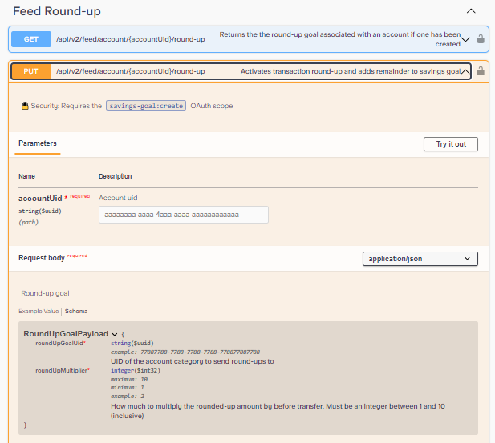
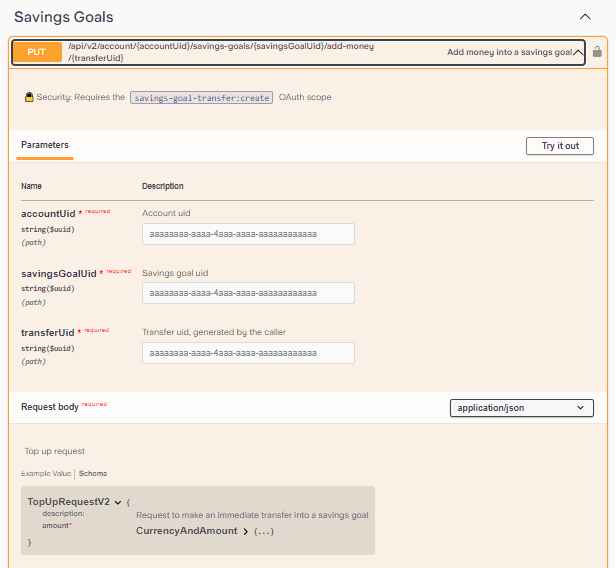
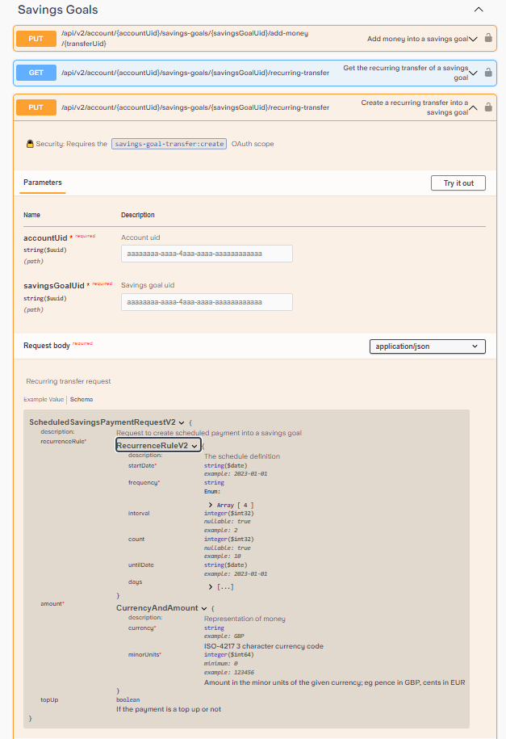
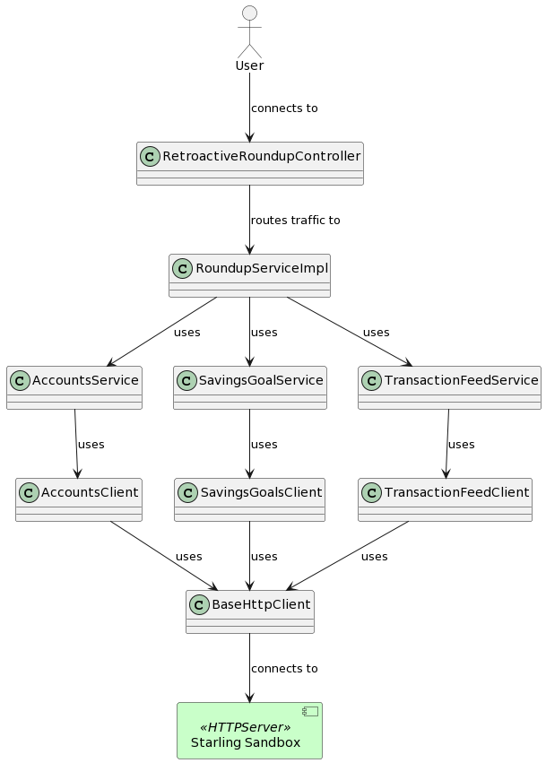
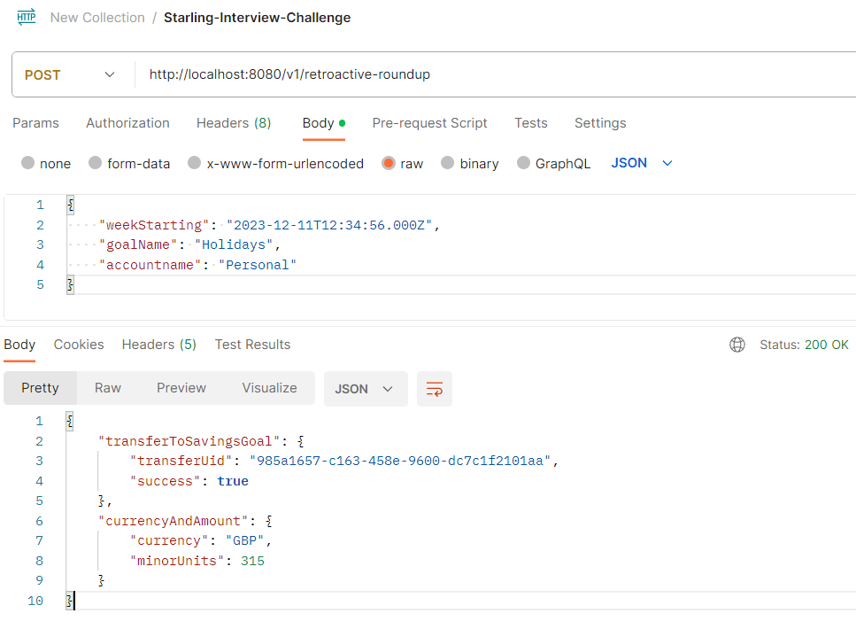
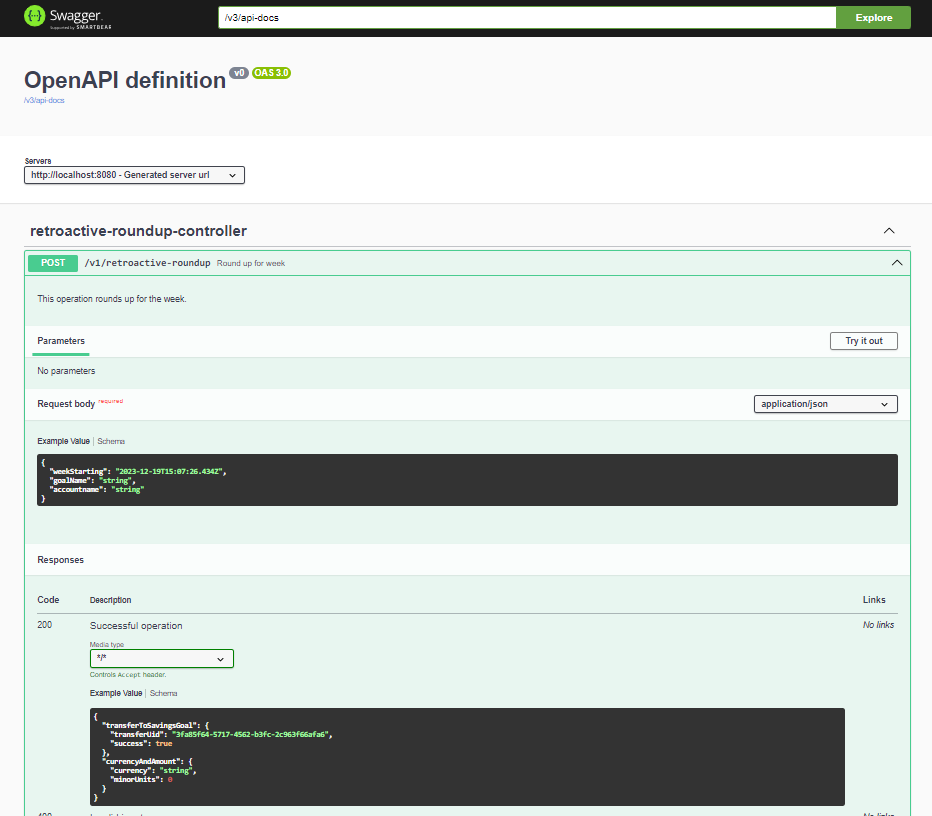

<!-- TOC start (generated with https://github.com/derlin/bitdowntoc) -->

# Introduction

Starling bank in the UK have a coding interview for potential candidates. This requires completing the programming challenge below. This repo contains several implementations including Spring Web MVC and Spring Reactive Web.

- [Getting Started](#getting-started)
   * [Cloning the repo](#cloning-the-repo)
- [Requirements](#requirements)
   * [Show me the data](#show-me-the-data)
   * [Requirements Summary](#requirements-summary)
   * [Checklist For Rubric](#checklist-for-rubric)
- [Implementation](#implementation)
   * [Assumptions](#assumptions)
   * [Show me the solution](#show-me-the-solution)
   * [How it works - Architecture](#how-it-works-architecture)
   * [Dependencies](#dependencies)
   * [Docker](#docker)
   * [Manual Build Steps](#manual-build-steps)
   * [Manual Launch Steps](#manual-launch-steps)
   * [Unit Tests](#unit-tests)
   * [Consuming The New Round-Up API](#consuming-the-new-round-up-api)
   * [Error Handling](#error-handling)
   * [Sample Logging output](#sample-logging-output)
   * [Application Properties](#application-properties)
   * [Security considerations](#security-considerations)
   * [Bugs](#bugs)
- [Scoring Summary](#scoring-summary)
- [External References](#external-references)

<!-- TOC end -->

<!-- TOC --><a name="getting-started"></a>
# Getting Started

Below project outlines an attempt by Hugh Pearse to complete the Starling Bank interview programming challenge. Focus of development was to showcase good java design principals.

<!-- TOC --><a name="cloning-the-repo"></a>
## Cloning the repo

```bash
foo@bar:~$ git clone https://github.com/hughpearse/starling-interview-challenge.git
```

<!-- TOC --><a name="requirements"></a>
# Requirements

Excerpt from PDF Challenge Details [here](./docs/Starling_Bank_Engineering__Technical_Challenge.pdf)

```text
The Challenge
We’d like you to develop a “round-up” feature for Starling customers using our public
developer API that is available to all customers and partners.
For a customer, take all the transactions in a given week and round them up to the nearest
pound. For example with spending of £4.35, £5.20 and £0.87, the round-up would be £1.58.
This amount should then be transferred into a savings goal, helping the customer save for
future adventures.

API calls
To make this work, the key parts from our public API you will need are:
1. Accounts - To retrieve accounts for the customer
2. Transaction feed - To retrieve transactions for the customer
3. Savings Goals - Create a savings goals and transfer money to savings goals
We do expect to see your working here: please do not use any of the libraries out there
which provide an sdk for interacting with our api.
```

Notes: 

Existing Round-up API does *NOT* allow user to specify input parameter for a given week. 



Neither does the savings goal API.



This differs from a recurring transfer which takes a *rule* to transfer a fixed value set in a CurrencyAndAmount object using the *amount* property.



This challenge is a new type of round-up API. The new API must combine the logic of round-up and savings, so a variable amount is saved on each given week.

<!-- TOC --><a name="show-me-the-data"></a>
## Show me the data

A FeedItem looks as follows:

```json
{
  "amount": {
    "currency": "GBP", //ISO-4217 3 character currency code
    "minorUnits": 123456
  },
  "sourceAmount": {
    "currency": "GBP", //ISO-4217 3 character currency code
    "minorUnits": 123456
  },
  "direction": "OUT", //Enum: [ IN, OUT ]
  "exchangeRate": 0,
  <a bunch of other stuff>
}
```

<!-- TOC --><a name="requirements-summary"></a>
## Requirements Summary

Given the following input parameters:
1. Date week start (eg: Sunday 1st January 2023, ending @ + 7 days)
2. Goal name (eg: Holidays)
3. Account name (eg: main current account)

Enumerate all transactions in a week. For each transaction calculate the round-up. Sum the list of round-ups. Transfer sum to savings goal.

<!-- TOC --><a name="checklist-for-rubric"></a>
## Checklist For Rubric

Below outlines some requirements to score points in the interview.

1. Compiles
2. Launches/Runs
3. Works as expected
4. Automated tests
5. Arrange Act Assert (AAA)
6. Documentation
7. Javadoc (code, not HTML due to annotations)
8. Swagger (inbound API)
9. README instructions
10. Code quality
11. Domain Driven Design (DDD)
12. Application of SOLID principals
13. Error handling
14. Logging
15. Builds to jar
16. Postman collection
17. Docker runtime

<!-- TOC --><a name="implementation"></a>
# Implementation

The solution is relatively easy to implement.

Source code implementing above 3 [recommended](#requirements) API calls can be found here:

1. Accounts - [link](./spring-mvc/src/main/java/com/starling/challenge/domain/services/starling/AccountsService.java)
2. Transaction feed - [link](./spring-mvc/src/main/java/com/starling/challenge/domain/services/starling/TransactionFeedService.java)
3. Savings Goals - [link](./spring-mvc/src/main/java/com/starling/challenge/domain/services/starling/SavingsGoalService.java)

Transactions can be represented as a java pojo:

```java
public class FeedItem {
    private CurrencyAndAmount amount;
    private CurrencyAndAmount sourceAmount;
    private String direction;
    private double exchangeRate;
}
public class CurrencyAndAmount {
    private Currency currency;
    private BigInteger minorUnits; // to prevent overflow when summing transactions
}
```

<!-- TOC --><a name="assumptions"></a>
## Assumptions

Transactions in scope will be limited as follows:
1. A savings goal called "Holidays" will be created
2. Transactions with specific criteria will be settled
3. Transactions must be settled
4. Transactions must be towards the "OUT" direction
5. Transactions between two foreign currencies (which do not match account settings), will be ignored

<!-- TOC --><a name="show-me-the-solution"></a>
## Show me the solution

Do the roundup [here](./spring-mvc/src/main/java/com/starling/challenge/domain/services/challenge/RoundupServiceImpl.java)

```java
/**
 * Sum the list of roundups in a list of feed items.
 * @param transactionFeed FeedItems object as a FeedItems object
 * @param account the account detils as a AccountV2 object
 * @return sum of roundups as a BigInteger
 */
private BigInteger sumFeedItems(FeedItems transactionFeed, AccountV2 account){
    List<FeedItem> feedItems = transactionFeed.getFeedItems();
    BigInteger roundupSum = BigInteger.ZERO;
    for(FeedItem feedItem : feedItems){
        if(feedItem.getDirection().equals(Direction.OUT) ){
            // Find correct amount based on currency in account settings
            CurrencyAndAmount amount = null;
            if(feedItem.getAmount().getCurrency().equals(account.getCurrency()))
            amount = feedItem.getAmount();
            if(feedItem.getSourceAmount().getCurrency().equals(account.getCurrency()))
            amount = feedItem.getSourceAmount();

            roundupSum = roundupSum.add(roundup(amount.getMinorUnits()));
        }
    }
    log.info("Sum of roundup is {} minor units.", roundupSum);
    return roundupSum;
}

/**
 * Roundup logic using modulo.
 * @param transaction input the minor units.
 * @return the rounded up value.
 */
private BigInteger roundup(BigInteger transaction) {
    BigInteger hundred = new BigInteger("100");
    BigInteger remainder = transaction.mod(hundred);
    if (remainder.equals(BigInteger.ZERO)) {
        return BigInteger.ZERO;
    } else {
        return hundred.subtract(remainder);
    }
}
```

Transfer to the savings goal [here](./spring-mvc/src/main/java/com/starling/challenge/domain/services/starling/SavingsGoalService.java)

```java
public SavingsGoalTransferResponseV2 transferToSavingsGoal(
    UUID accountUid,
    UUID savingsGoalUUID, 
    TopUpRequestV2 topUpRequestV2
    ){
        SavingsGoalTransferResponseV2 transferToSavingsGoal = savingsGoalsClient.transferToSavingsGoal(
        accountUid, 
        savingsGoalUUID, 
        UUID.randomUUID(), 
        topUpRequestV2);
        log.info("Transfer completed.");
        return transferToSavingsGoal;
}
```

<!-- TOC --><a name="how-it-works-architecture"></a>
## How it works - Architecture

Steps:

0. An external user sends a request
1. Layer 1: The controller routes traffic to the roundup service which starts the whole process
2. Layer 2: The client logic is in a saparate logical domain (eg: roundup service)
3. Layer 3: Each logical domain is assigned a domain service (eg: get account -> or create account if doesnt exist)
4. Layer 4: Each domain service is assigned its own client (accounts, transactions etc) with URLs configured to interact with external systems.
5. Layer 5: A base HTTP client is configured for the Starling server hostname.
6. The HTTP traffic is sent to the external Starling services.



This architecture should be resilient enough to require minimal changes for future requirements.

<!-- TOC --><a name="dependencies"></a>
## Dependencies

Install Java 17

```bash
foo@bar:~$ wget https://download.oracle.com/java/17/latest/jdk-17_linux-x64_bin.rpm
foo@bar:~$ sudo yum -y install ./jdk-17_linux-x64_bin.rpm
```

<!-- TOC --><a name="docker"></a>
## Docker

You can launch one of the precompiled [release](https://github.com/hughpearse/starling-interview-challenge/releases/) jars with docker:

```bash
foo@bar:starling-interview-challenge$ docker run -p 8080:8080 -v $(pwd)/build/libs/challenge-0.0.1-SNAPSHOT.jar:/app.jar eclipse-temurin:17.0.9_9-jre-jammy java -jar /app.jar  --outboundclients.starling.core.accesstoken=eyJhbGciOiJ
```

or build from source with Docker and launch with Docker (easiest)

```bash
foo@bar$ docker run -it eclipse-temurin:17.0.9_9-jdk-jammy /bin/bash -c 'apt-get update && apt-get install -y git && git clone https://github.com/hughpearse/starling-interview-challenge.git /tmp/starling-interview-challenge && cd /tmp/starling-interview-challenge/spring-mvc/ && /tmp/starling-interview-challenge/spring-mvc/gradlew bootRun -Prun.args="--outboundclients.starling.core.accesstoken=eyJhbGciOiJ"'
```

<!-- TOC --><a name="manual-build-steps"></a>
## Manual Build Steps

Run the following command to build the classes and release the jar

```bash
foo@bar:starling-interview-challenge/spring-mvc/$ ./gradlew build -x test
```

<!-- TOC --><a name="manual-launch-steps"></a>
## Manual Launch Steps

Run the following command to start the application locally 

```bash
foo@bar:starling-interview-challenge/spring-mvc/$ ./gradlew bootRun -Prun.args="--outboundclients.starling.core.accesstoken=eyJhbGciOiJ"
```

<!-- TOC --><a name="unit-tests"></a>
## Unit Tests

Run the following command to run junit tests

```bash
foo@bar:starling-interview-challenge/spring-mvc/$ ./gradlew test
```

Code can be found here:
1. [AccountServiceTest](./spring-mvc/src/test/java/com/starling/challenge/domain/services/starling/AccountServiceTest.java)
2. [SavingsGoalServiceTest](./spring-mvc/src/test/java/com/starling/challenge/domain/services/starling/SavingsGoalServiceTest.java)
3. [TransactionFeedServiceTest](./spring-mvc/src/test/java/com/starling/challenge/domain/services/starling/TransactionFeedServiceTest.java)

<!-- TOC --><a name="consuming-the-new-round-up-api"></a>
## Consuming The New Round-Up API

Send a post body similar to:
```json
{
  "weekStarting": "2023-12-11T12:34:56.000Z",
  "goalName": "Your Goal Name",
  "accountname": "Your Account Name"
}
```
as:

Test 1 - Happy path:

```bash
foo@bar:~$ curl -X POST -H "Content-Type: application/json" -d '{
  "weekStarting": "2023-12-11T12:34:56.000Z",
  "goalName": "Holidays",
  "accountname": "Personal"
}' http://localhost:8080/v1/retroactive-roundup
```

Test 2 - Client data validation error (bad date):

```bash
foo@bar:~$ curl -X POST -H "Content-Type: application/json" -d '{
  "weekStarting": "AAA",
  "goalName": "Holidays",
  "accountname": "Personal"
}' http://localhost:8080/v1/retroactive-roundup
```

Test 3 - Null pointer error (bad account name)

```bash
foo@bar:~$ curl -X POST -H "Content-Type: application/json" -d '{
  "weekStarting": "2023-12-11T12:34:56.000Z",
  "goalName": "Holidays",
  "accountname": "AAA"
}' http://localhost:8080/v1/retroactive-roundup
```

There is a provided postman collection [here](./docs/Starling-interview-challenge.postman_collection.json)



and a frontend when the server is running

http://localhost:8080/swagger-ui/index.html



<!-- TOC --><a name="error-handling"></a>
## Error Handling

Upstream errors are parsed by the clients [here](./spring-mvc/src/main/java/com/starling/challenge/outboundclients/starling/AccountsClient.java), and thrown to the challenge application.

```java
/**
 * Get all accounts.
 * @return Accounts object
 */
public Accounts getAccounts() {
    try {
        log.info("Getting all accounts.");
        return baseHttpClient
        .getClient()
        .get()
        .uri(listaccnumsurl)
        .accept(MediaType.APPLICATION_JSON)
        .retrieve()
        .onStatus(HttpStatusCode::is4xxClientError, (request, response) -> { 
            throw new StarlingRuntimeException(response);
        })
        .body(Accounts.class);
    } catch (StarlingRuntimeException ex) {
        log.error("Failed to get accounts.");
        throw ex;
    }
}
```

There are 3 types of errors (1.) client errors (2.) microservice errors (3.) backend errors. All are handled [here](./web-spring/src/main/java/com/starling/challenge/inboundapicontrollers/ErrorAdviceController.java):

```java
@ExceptionHandler(HttpMessageNotReadableException.class)
public ResponseEntity<ErrorResponse> handleValidationExceptions(
HttpMessageNotReadableException ex) {
    ErrorResponse errors = new ErrorResponse();
    ErrorDetail errorDetail = new ErrorDetail();
    errorDetail.setMessage(ex.getMessage());
    errors.setErrors(Arrays.asList(errorDetail));
    errors.setSuccess(false);
    return new ResponseEntity<>(errors, HttpStatus.BAD_REQUEST);
} 
```

Example:

```json
{
  "errors": [
    {
      "message": "JSON parse error: Cannot deserialize value of type `java.util.Date` from String \"2023-12-11T12:34:56.000ZARR\": not a valid representation (error: Failed to parse Date value '2023-12-11T12:34:56.000ZARR': Cannot parse date \"2023-12-11T12:34:56.000ZARR\": while it seems to fit format 'yyyy-MM-dd'T'HH:mm:ss.SSSX', parsing fails (leniency? null))"
    }
  ],
  "success": false
}
```

<!-- TOC --><a name="sample-logging-output"></a>
## Sample Logging output

```text
2023-12-18T16:43:37.365Z  INFO 17704 --- [nio-8080-exec-2] c.s.c.d.s.challenge.RoundupServiceImpl   : Roundup request received.
2023-12-18T16:43:37.365Z  INFO 17704 --- [nio-8080-exec-2] c.s.c.o.starling.BaseHttpClient          : Getting all accounts.
2023-12-18T16:43:38.056Z  INFO 17704 --- [nio-8080-exec-2] c.s.c.d.s.starling.AccountsService       : Account found.
2023-12-18T16:43:38.056Z  INFO 17704 --- [nio-8080-exec-2] c.s.c.o.starling.SavingsGoalsClient      : Getting savings goals
2023-12-18T16:43:38.192Z  INFO 17704 --- [nio-8080-exec-2] c.s.c.d.s.starling.SavingsGoalService    : Savings goal found.
2023-12-18T16:43:38.192Z  INFO 17704 --- [nio-8080-exec-2] c.s.c.o.starling.TransactionFeedClient   : Getting trancations from account 02ceb441-492e-43e1-8db7-58b4190d9f76 in range from 1702298096000 to 1702902896000
2023-12-18T16:43:38.388Z  INFO 17704 --- [nio-8080-exec-2] c.s.c.d.s.s.TransactionFeedService       : Got transaction feed.
2023-12-18T16:43:38.388Z  INFO 17704 --- [nio-8080-exec-2] c.s.c.d.s.challenge.RoundupServiceImpl   : Found 14 transactions.
2023-12-18T16:43:38.388Z  INFO 17704 --- [nio-8080-exec-2] c.s.c.d.s.challenge.RoundupServiceImpl   : Sum of roundup is 315 minor units.
2023-12-18T16:43:38.388Z  INFO 17704 --- [nio-8080-exec-2] c.s.c.o.starling.SavingsGoalsClient      : Transfering CurrencyAndAmount(currency=GBP, minorUnits=315) from account 02ceb441-492e-43e1-8db7-58b4190d9f76 to savings goal 12434de2-28cd-4230-a703-533ca04546a2.
2023-12-18T16:43:38.568Z  INFO 17704 --- [nio-8080-exec-2] c.s.c.d.s.starling.SavingsGoalService    : Transfer completed.
```

<!-- TOC --><a name="application-properties"></a>
## Application Properties

The application runtime properties are set [here](./web-spring/src/main/resources/application.yaml)

```yaml
outboundclients:
  starling:
    core:
      accesstoken: YOUR-JWT-HERE
```

You can easily set this property at runtime as a command line argument, as shown in the examples above.

<!-- TOC --><a name="security-considerations"></a>
## Security considerations

The access token is set in the application [here](./web-spring/src/main/java/com/starling/challenge/outboundclients/starling/BaseHttpClient.java). An attempt has been made in the starling challenge codebase to keep the access token set as a character array which will place the values on the JVM stack, instead of in heap memory. If the application crashes, hopefully the value will not be serialized to disk.

```java
/**
 * Constructor for Starling base auth HTTP client.
 * @param starlingbaseurl injected base hostname
 * @param accesstoken injected access token for Bearer auth
 * @param restClientBuilder injected HTTP client object
 */
public BaseHttpClient(
    @Value("${outboundclients.starling.core.baseurl}")
    String starlingbaseurl,
    @Value("${outboundclients.starling.core.accesstoken}")
    char[] accesstoken, // <-----  HERE
    RestClient.Builder restClientBuilder
){
    this.restClient = restClientBuilder
    .baseUrl(starlingbaseurl)
    .defaultHeader(HttpHeaders.AUTHORIZATION, "Bearer " + String.valueOf(accesstoken))
    .defaultHeader(HttpHeaders.USER_AGENT, "Hugh Pearse")
    .build();
}
```

<!-- TOC --><a name="bugs"></a>
## Bugs

There is some room for improvement around creating the savings goals, with the currency type and account type.

1. Transactions API does not support updating the transaction feed item to manually mark individual items as rounded up.
2. In swagger docs for FeedItem, amount and sourceAmount are not explained in reference to the account settings
3. In swagger docs for SavingsGoalRequestV2, there is both a currency variable and target.currency variable.

<!-- TOC --><a name="scoring-summary"></a>
# Scoring Summary

Below outlines some requirements to score points in the interview.

1. Compiles - YES
2. Launches/Runs - YES
3. Works as expected - YES
4. Automated tests - YES
5. Arrange Act Assert (AAA) - YES
6. Documentation - YES
7. Javadoc (code, not HTML due to annotations) - YES
8. Swagger (inbound API) - YES
9. README instructions - YES
10. Code quality - YES
11. Domain Driven Design (DDD) - YES
12. Application of SOLID principals - YES
13. Error handling - YES
14. Logging - YES
15. Builds to jar - YES
16. Postman collection - YES
17. Docker runtime - YES

Score = 17 / 17 -> 100%

<!-- TOC --><a name="external-references"></a>
# External References

1. PDF Challenge Details [here](./docs/Starling_Bank_Engineering__Technical_Challenge.pdf)
2. Documentation [here](https://developer.starlingbank.com/docs)
3. Starling Swagger json [here](./docs/starling-swagger.json)
4. Prior art research [here](https://github.com/Noah-Vincenz/starling-api-round-up/tree/main)

# Note
I went to all this effort and they still said "no".
