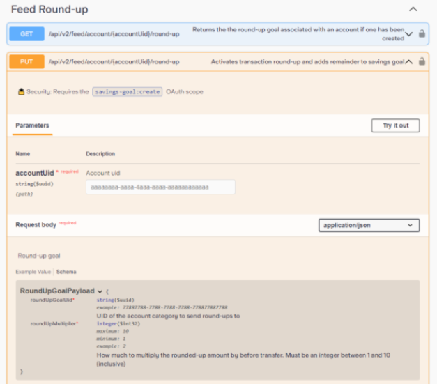
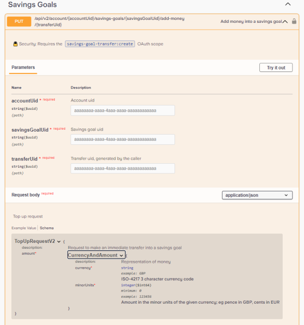

# Getting Started

Below project outlines an attempt by Hugh Pearse to complete the Starling Bank interview programming challenge. Focus of development was to showcase good java design principals.

## Cloning the repo

```bash
foo@bar:~$ git clone https://github.com/hughpearse/starling-interview-challenge.git
```

## How it works

1. A base HTTP client is configured for the hostname.
2. Each logical domain is assigned its own client (accounts, transactions etc) with URLs configured.
3. Each logical domain client is assigned a domain service (eg: get account -> or create account if doesnt exist)
4. The client logic is in a saparate logical domain (eg: roundup service)
5. The controller routes traffic to the roundup service which starts the whole process


The roundup logic is define in [RoundupServiceImpl.java](./src/main/java/com/starling/challenge/domain/services/challenge/RoundupServiceImpl.java). There a some room for improvement around the Starling specific data relating to exchange rates and summing the roundup overflow.

## Assumptions

Given the complex nature of these requirements and the limited time frame, the scope will be limited as follows:
1. A savings goal called "Holidays" will be created
2. Transactions with specific criteria will be settled
4. Transactions must be settled
5. Transactions must be towards the "OUT" direction

## Requirements

Excerpt from PDF Challenge Details [here](./docs/Starling_Bank_Engineering__Technical_Challenge.pdf)

```text
The Challenge
We’d like you to develop a “round-up” feature for Starling customers using our public
developer API that is available to all customers and partners.
For a customer, take all the transactions in a given week and round them up to the nearest
pound. For example with spending of £4.35, £5.20 and £0.87, the round-up would be £1.58.
This amount should then be transferred into a savings goal, helping the customer save for
future adventures.

API calls
To make this work, the key parts from our public API you will need are:
1. Accounts - To retrieve accounts for the customer
2. Transaction feed - To retrieve transactions for the customer
3. Savings Goals - Create a savings goals and transfer money to savings goals
We do expect to see your working here: please do not use any of the libraries out there
which provide an sdk for interacting with our api.
```

Notes: Existing Round-up API does *NOT* allow user to specify input parameter for a given week. This challenge is a new type of round-up API.



and neither does the savings goal API



The new API must combine the logic of round-up and savings, so a variable amount is saved on each given week. This differs from a recurring transfer which takes a fixed value.


## Show me the data

A FeedItem looks as follows:
```json
{
  "amount": {
    "currency": "GBP", //ISO-4217 3 character currency code
    "minorUnits": 123456
  },
  "sourceAmount": {
    "currency": "GBP", //ISO-4217 3 character currency code
    "minorUnits": 123456
  },
  "direction": "OUT", //Enum: [ IN, OUT ]
  "status": "SETTLED", //Enum: [ UPCOMING, PENDING, REVERSED, SETTLED, DECLINED, REFUNDED, RETRYING, ACCOUNT_CHECK ]
  "exchangeRate": 0,
}
```

This can be represented as a java pojo:

```java
public class FeedItem {
    private CurrencyAndAmount amount;
    private CurrencyAndAmount sourceAmount;
    private String direction;
    private String status;
    private double exchangeRate;
}
public class CurrencyAndAmount {
    private String currency;
    private int minorUnits;    
}
```

## Show me the solution

The solution is relatively easy to implement.

```java
/**
 * Sum the list of roundups in a list of feed items.
 * @param transactionFeed FeedItems object as a FeedItems object
 * @param account the account detils as a AccountV2 object
 * @return sum of roundups as a BigInteger
 */
private BigInteger sumFeedItems(FeedItems transactionFeed, AccountV2 account){
    List<FeedItem> feedItems = transactionFeed.getFeedItems();
    BigInteger roundupSum = BigInteger.ZERO;
    for(FeedItem feedItem : feedItems){
        if(feedItem.getDirection().equals("OUT") && feedItem.getStatus().equals("SETTLED")){
            
            // Find correct amount based on account settings
            CurrencyAndAmount amount = null;
            if(feedItem.getAmount().getCurrency().equals(account.getCurrency()));
            amount = feedItem.getAmount();
            if(feedItem.getSourceAmount().getCurrency().equals(account.getCurrency()));
            amount = feedItem.getSourceAmount();

            roundupSum = roundupSum.add(roundup(amount.getMinorUnits()));
        }
    }
    log.info("Sum of roundup is {} minor units.", roundupSum);
    return roundupSum;
}

/**
 * Roundup logic using modulo.
 * @param transaction input the minor units.
 * @return the rounded up value.
 */
private BigInteger roundup(BigInteger transaction) {
    BigInteger hundred = new BigInteger("100");
    BigInteger remainder = transaction.mod(hundred);
    if (remainder.equals(BigInteger.ZERO)) {
        return BigInteger.ZERO;
    } else {
        return hundred.subtract(remainder);
    }
}
```

But the secret to passing an interview also requires good architecture :)

## Requirements Summary

Given the following input parameters:
1. Date week start (eg: Sunday 1st January 2023, ending @ + 7 days)
2. Goal name (eg: Holidays)
3. Account name (eg: main current account)

Enumerate all transactions in a week. For each transaction calculate the round-up. Sum the list of round-ups. Transfer sum to savings goal.

## Checklist for rubric

Below outlines some requirements to score points in the interview.

1. Compiles - YES
2. Launches/Runs - YES
3. Works as expected - YES
4. Automated tests - YES
5. Arrange Act Assert (AAA) - YES
6. Documentation - YES
7. Javadoc (code, not HTML due to annotations) - YES
8. Swagger (inbound API) - YES
9. README instructions - YES
10. Code quality - YES
11. Domain Driven Design (DDD) - YES
12. Application of SOLID principals - YES
13. Error handling - YES
14. Logging - YES
15. Builds to jar - YES
16. Postman collection - YES
17. Docker runtime - YES

## Dependencies

Install Java 17

```bash
foo@bar:~$ wget https://download.oracle.com/java/17/latest/jdk-17_linux-x64_bin.rpm
foo@bar:~$ sudo yum -y install ./jdk-17_linux-x64_bin.rpm
```

## Docker

If you cant be bothered installing java 17 locally, launch one of the [release](https://github.com/hughpearse/starling-interview-challenge/releases/) jars with docker:

```bash
foo@bar:starling-interview-challenge$ docker run -p 8080:8080 -v $(pwd)/build/libs/challenge-0.0.1-SNAPSHOT.jar:/app.jar eclipse-temurin:17.0.9_9-jre-jammy java -jar /app.jar  --outboundclients.starling.core.accesstoken=eyJhbGciOiJ
```

or build from source and launch with Docker

```bash
foo@bar$ docker run -it eclipse-temurin:17.0.9_9-jdk-jammy /bin/bash -c 'apt-get update && apt-get install -y git && git clone https://github.com/hughpearse/starling-interview-challenge.git /tmp/starling-interview-challenge && cd /tmp/starling-interview-challenge/ && /tmp/starling-interview-challenge/gradlew bootRun -Prun.args="--outboundclients.starling.core.accesstoken=eyJhbGciOiJ"'
```

## Build

Run the following command to build the classes

```bash
foo@bar:starling-interview-challenge$ ./gradlew build -x test
```

Run the following command to release the jar

```bash
foo@bar:starling-interview-challenge$ ./gradlew jar
```

## Launch

Run the following command to start the application locally 

```bash
foo@bar:starling-interview-challenge$ ./gradlew bootRun
```

## Tests

Run the following command to run junit tests

```bash
foo@bar:starling-interview-challenge$ ./gradlew test
```

## Consuming:

Send a post body similar to:
```json
{
  "weekStarting": "2023-12-11T12:34:56.000Z",
  "goalName": "Your Goal Name",
  "accountname": "Your Account Name"
}
```
as:

```bash
foo@bar:~$ curl -X POST -H "Content-Type: application/json" -d '{
  "weekStarting": "2023-12-11T12:34:56.000Z",
  "goalName": "Holidays",
  "accountname": "Personal"
}' http://localhost:8080/v1/retroactive-roundup
```

There is a provided postman collection [here](./docs/Starling-interview-challenge.postman_collection.json)


and a frontend when the server is running

http://localhost:8080/swagger-ui/index.html


## Sample Logging output

```text
2023-12-18T16:43:37.365Z  INFO 17704 --- [nio-8080-exec-2] c.s.c.d.s.challenge.RoundupServiceImpl   : Roundup request received.
2023-12-18T16:43:37.365Z  INFO 17704 --- [nio-8080-exec-2] c.s.c.o.starling.BaseHttpClient          : Getting all accounts.
2023-12-18T16:43:38.056Z  INFO 17704 --- [nio-8080-exec-2] c.s.c.d.s.starling.AccountsService       : Account found.
2023-12-18T16:43:38.056Z  INFO 17704 --- [nio-8080-exec-2] c.s.c.o.starling.SavingsGoalsClient      : Getting savings goals
2023-12-18T16:43:38.192Z  INFO 17704 --- [nio-8080-exec-2] c.s.c.d.s.starling.SavingsGoalService    : Savings goal found.
2023-12-18T16:43:38.192Z  INFO 17704 --- [nio-8080-exec-2] c.s.c.o.starling.TransactionFeedClient   : Getting trancations from account 02ceb441-492e-43e1-8db7-58b4190d9f76 in range from 1702298096000 to 1702902896000
2023-12-18T16:43:38.388Z  INFO 17704 --- [nio-8080-exec-2] c.s.c.d.s.s.TransactionFeedService       : Got transaction feed.
2023-12-18T16:43:38.388Z  INFO 17704 --- [nio-8080-exec-2] c.s.c.d.s.challenge.RoundupServiceImpl   : Found 14 transactions.
2023-12-18T16:43:38.388Z  INFO 17704 --- [nio-8080-exec-2] c.s.c.d.s.challenge.RoundupServiceImpl   : Sum of roundup is 315 minor units.
2023-12-18T16:43:38.388Z  INFO 17704 --- [nio-8080-exec-2] c.s.c.o.starling.SavingsGoalsClient      : Transfering CurrencyAndAmount(currency=GBP, minorUnits=315) from account 02ceb441-492e-43e1-8db7-58b4190d9f76 to savings goal 12434de2-28cd-4230-a703-533ca04546a2.
2023-12-18T16:43:38.568Z  INFO 17704 --- [nio-8080-exec-2] c.s.c.d.s.starling.SavingsGoalService    : Transfer completed.
```

## Bugs

1. Transactions API does not support updating the transaction feed item to manually mark individual items as rounded up.
2. In swagger docs for FeedItem, amount and sourceAmount are not explained in reference to the account settings
3. In swagger docs for SavingsGoalRequestV2, there is both a currency variable and target.currency variable.

# References

1. PDF Challenge Details [here](./docs/Starling_Bank_Engineering__Technical_Challenge.pdf)
2. Documentation [here](https://developer.starlingbank.com/docs)
3. Swagger json [here](./docs/starling-swagger.json)
4. Prior art research [here](https://github.com/Noah-Vincenz/starling-api-round-up/tree/main)
